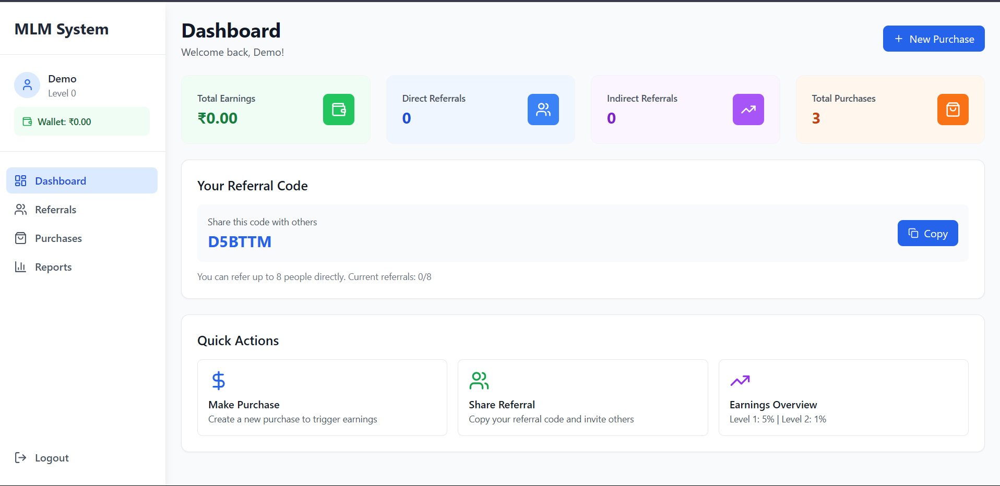
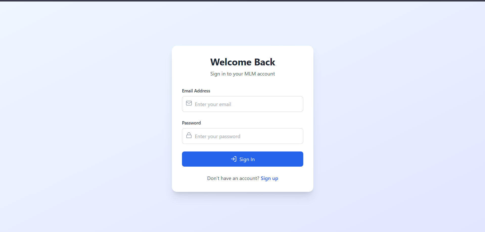

# 💸 MLM Referral System — Real-time Earnings, Real Cool 😎

A full-fledged 💥 Multi-Level Marketing (MLM) referral system powered by the mighty **MERN stack**, featuring live updates, slick analytics, and an interface that *actually looks good*! 🎨

> 🧠 Perfect for showcasing referral-based earnings, performance tracking, and real-time notifications 💸⚡

---

## 📸 Screenshots

### 🏠 Dashboard


### 🔐 Login Page


## ✨ Features at a Glance

### 🕉 Core System

* 🔐 **JWT Authentication** – Safe & secure login
* 👥 **2-Level Referral Network** – With unique codes
* 💳 **Smart Purchase System** – Auto earnings distribution
* 🦾 **Live Earnings Alerts** – Socket.IO powered real-time updates
* 📋 **Analytics Dashboard** – Clean, insightful reports

### 🧠 Business Logic

* 🌐 Max 8 direct referrals per user
* 💰 Commission structure:

  * 🥇 Level 1: 5%
  * 🥈 Level 2: 1%
* ✅ Minimum ₹1000 for valid earnings
* 🔔 Instant wallet and UI updates

### 💅 Frontend Goodies

* 🧼 Tailwind-powered modern UI
* 📱 Fully responsive, mobile-first
* 🛁 Real-time feedback with toasts
* 🧮 Interactive & intuitive dashboard

---

## 🛠 Tech Stack

| Layer       | Tools Used                                                                |
| ----------- | ------------------------------------------------------------------------- |
| 🧠 Frontend | React 18, Tailwind CSS, React Router, Lucide, Axios, Hot Toast, Socket.IO |
| 🛠 Backend  | Node.js, Express, MongoDB, Mongoose, JWT, bcrypt, Socket.IO               |

---

## 📁 Folder Structure

```
mlm-referral-system/
├── server/               # Backend magic
│   ├── models/           # Mongoose schemas
│   ├── routes/           # REST APIs
│   ├── middleware/       # Auth + helpers
│   └── index.js          # Server entry
├── src/                  # Frontend React app
│   ├── components/       # Layouts, Spinner, etc.
│   ├── contexts/         # Auth + Socket Contexts
│   ├── pages/            # Login, Dashboard, Reports...
│   ├── App.jsx
│   └── main.jsx
└── README.md
```

---

## ⚡ Quickstart Guide

### 🧱 Requirements

* Node.js (v16+)
* MongoDB (local or Atlas)
* npm / yarn

### 🧲 Installation

```bash
git clone <repo-url>
cd mlm-referral-system
npm install
```

### 🧲 .env Setup

Create a `.env` in `server/`:

```
MONGODB_URI=mongodb://localhost:27017/mlm-referral
JWT_SECRET=your-secret-key
PORT=4862
```

### 🚀 Run It

```bash
npm run dev
```

* Frontend ➔ [http://localhost:5173](http://localhost:5173)
* Backend ➔ [http://localhost:4862](http://localhost:4862)

---

## 🔍 Database Models

### 👤 User

```js
{
  name, email, password,
  referralCode, referredBy,
  referrals: [String], wallet,
  level, isActive,
  createdAt, updatedAt
}
```

### 💸 Purchase

```js
{
  userId, amount, isValid,
  description, createdAt
}
```

### 🦹 Earning

```js
{
  userId, fromUserId, amount,
  level, purchaseId, createdAt
}
```

---

## 🔗 Key API Endpoints

| Route                      | Description           |
| -------------------------- | --------------------- |
| POST `/api/auth/register`  | Register a new user   |
| POST `/api/auth/login`     | Login & get JWT token |
| GET `/api/user/profile`    | Fetch logged-in user  |
| POST `/api/purchase`       | Make a purchase       |
| GET `/api/report/earnings` | Get earnings report   |

---

## 🎨 UI Highlights

* 📈 Dashboard with live stats
* 🌳 Referral tree view
* 💼 Purchase tracking
* 🔄 Real-time wallet & toasts
* 💼 Performance analytics

---

## 🔐 Security & Optimization

* JWT tokens with role-based auth
* Passwords hashed with bcrypt
* Protected routes middleware
* Optimized DB queries
* Efficient socket usage

---

## 🚀 Deployment Tips

### 🌍 Backend

* Deploy on Render, Railway, or Heroku
* Set env vars → `MONGODB_URI`, `JWT_SECRET`
* Start command: `npm run server`

### 🖼 Frontend

* Build with: `npm run build`
* Deploy `dist/` to Netlify or Vercel

### ☁️ MongoDB

* Use Atlas connection string
* Replace in `.env` under `MONGODB_URI`

---

